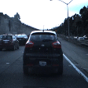

## The comma.ai [speed prediction challenge](https://github.com/commaai/speedchallenge)

Given a training set of a driving video at 20 fps and speed labels for each frame, we are required to predict speed for a test video. 
* I started with the assumption that no other training data should be used, mainly because this contains the scope and therefore makes it an interesting and challenging problem
* The two datasets are somewhat similar: both have stretches of highway and city roads, but there are some differences too ..
* In the training video, the car never stops at a signal or a stop-sign without having a vehicle right in front of it. Whereas, the test set has multiple scenarios where ego is at zero speed waiting all alone. 
* Test video has some narrow sharp turns that training does not have. 
* Some of the turns in the test set are sloping up and down, whereas the training-set has mostly level roads

 
Highway (train)        |Stop sign (train)            |Stop sign (train)             
:-------------------------:|:-------------------------------:|:----------------------------------:
 ||

 
Sharp turns (test)         |Stop sign (test)                 |No car in sight! (test)      
:-------------------------:|:-------------------------------:|:-------------------------------:
||


--------------------------------------------------------
## Dataset


```python
from odometry import *
%matplotlib inline

d = Dataset.load("train", n_sequences=2)
plt.plot(d.labels[:,0])
plt.show()
plt.plot(*d.stats())
```


    [<matplotlib.lines.Line2D at 0x7f551c035a10>]


The labels are not quite balanced. There's a bias towards certain velocities. To balance the data, we resample the features based on the labels


```python
d = d.resample(nsamples=2000)
plt.plot(*d.stats())
plt.show()
plt.plot(d.labels[:,0])
```


    [<matplotlib.lines.Line2D at 0x7f551eacf110>]


Though the balanced dataset showed less bias, the predictor was losing some valuable scenarios in the bargain. Instead, using data augmentation, I rebalanced the dataset by adding, not removing data.


(The blue plot shows the original dataset distribution. The red, orange and green squiggly lines represent the data that is being augmented and finally, the violet line stands for the (somewhat!) balanced dataset

-------------------------
## Network

I researched and implemented the following network models in the same order:

1. [DeepVO](https://arxiv.org/abs/1611.06069): The model consists of two parallel Siamese networks (based on AlexNet) extracting convolutional features from the two consecutive images and then subjecting the combination to dense layers. This model assumes that the network can learn high-level features from individual frames and then predict based on those features. 

The drawback was that these high-level features are not easily transferable across contexts and therefore caused some overfitting.

2. [FlowNet](https://arxiv.org/abs/1504.06852): This network stacks the two consecutive images right at the start and performs deep convolutions in an attempt to extract optical flow vectors. The central idea is that these optical flow predictions are upsampled at various layers to provide a full optical flow output. Instead, I added a regression layer right after the last convolutional layer. 

FlowNet is apparently able to overcome the above-mentioned shortcoming by using the first few convolutional layers to detect optical flow vectors from the frames. Neverthless, this does not exploit the temporal relationships between consecutive frames and therefore, subsequent predictions varied a lot sometimes.

3. [DeepVO RNN](https://arxiv.org/abs/1709.08429): This model (unrelated to DeepVO above) is obtained by tail-ending a FlowNet model with a LSTM/RNN to learn temporal relationships between consecutive speeds. In this case, the dataset is divided into short clips and trained/predicted as individual sequences.

The unidirectional nature of RNNs limited the amount of relationship that could be learnt across frames.

4. [C3D](https://arxiv.org/abs/1412.0767): Why struggle with single-directional RNNs when you can convolute all over the clip-sequence? This paper introduces the idea of 3D convolution over the frames across time. This is found to form correlations across frames and is more resilient to point failures in single frames with shadows. I used the pretrained weights from Sports1M dataset and retrained the whole network. I used SGD as the optimizer because part of the network was pretrained.

I used a 16 level deep convolution, but it is easy to see how deeper convolutions can smoother predictions and overstep difficult frames. But Conv3D computations are expensive, and pretrained weights were available only for a model with 16 channels.

---------
## Training

I initially chose not to use pretrained weights and instead trained the networks end-to-end, as a learning exercise in regularization. Needless to say, it took many epochs to converge and somewhat limited my network size too. The following contributed to effective training:

1. Shuffling features and labels during start of training and at the end of each epoch
2. Normalizing input images and hidden layers using batch normalization
3. Dropout layers to regularize activations from prediction layers

Later, when I moved to using pretrained weights, convergence was a lot faster. 

```python
from odometry import *
%matplotlib inline

d = Dataset.load('train', n_sequences=16, strided_sequences=True)

# Balancing data - Stage 1 and Stage 2
d1 = d.scaled_sequences(5, 10)
d2 = d.scaled_sequences(13, 14.5)
d3 = d.scaled_sequences(6, 7.5, 4)
z = d.stationary_sequences(500)

# Turn and slope augmentation - only for Stage 2
t = d.clip(15000, 20400).turn_sequences(1, 15, 4694)
s = d.clip(15000, 20400).sloped_sequences(3, 10, 1000)

dd = d.append(d1).append(d2).append(d3).append(z).append(t).append(s)

print('Dataset size - ', dd.labels.shape)

# Loading trained network from Stage 1
n = Network.load('final-stage1.01-3.63.hdf5')
callbacks = [n.stopping, n.checkpoint]
n.train(dd, batch_size=4, epochs=30, callbacks=callbacks)
```

For C3D training, it was found better to first train the network on all training samples and then finetune the network on the data augmented with turns. 

--------------------
## Data augmentation

### Shadows and brightness

Initial results were poor mostly because of bias due to lighting and shadows. A simple solution is to randomly introduce shadows and brightness levels in the training data (keeping validation data untouched)


```python
d = Dataset.load("train", n_sequences=2).resample(nsamples=2000)
gen = d.generator()
for i in range(0,3000,1000):
    im = gen[i][0][0,0,:,:,0:3]
    plt.imshow(im)
    plt.show()
```
|                              |                            |                          |
|:----------------------------:|:--------------------------:|:------------------------:|
||||

### Stationary sequences

The predictor had some issues because of insufficient data. The training set had very few frames where the car was stopping without a vehicle ahead of it whereas the test set was replete with this scenario. In order to alleviate this condition, I created faux sequences where random frames were chosen and repeated, and labelled with zero velocity.

|   True stationary           |    Faux stationary  |
|:----------------------------|:-------------------:|
|     ||

### Slow-speed sequences

There was also under-representation of medium speed values. Therefore, I randomly chose frames from lower-speed bins and scaled them up by a factor of 2 or 4 by skipping appropriate frames and scaling down speed labels.

|     Orig speed @ 6.01       |       2X speed @ 12.02      |   4X speed @ 24.04     |
|:----------------------------:|:--------------------------:|:------------------------:|
||||

```python
d = Dataset.load('train', n_sequences=16, strided_sequences=True)
plt.plot(*d.stats())

d1 = d.scaled_sequences(5, 10)
d2 = d.scaled_sequences(13, 14.5)
d3 = d.scaled_sequences(6, 7.5, 4)
z = d.stationary_sequences(500)
plt.plot(*d1.stats())
plt.plot(*d2.stats())
plt.plot(*d3.stats())

# Balanced dataset
d = d.append(d1).append(d2).append(d3).append(z)
```

### Turns

Turns were the most challenging of scenarios to handle. The training set had very few turns and most of them were on gentle level curves. The test set, on the other hand, had a few sharp turns that were either climbing up or down. The network learnt spurious predictions because assumedly, it was getting confused by the motion vectors running perpendicular to the line of vision. 

In order to fix this, I sampled medium-speed frames and progressively cropped out subsequent frames with the crop window moving from right to left. When put together, these cropped clips create an illusion of turning left. If the original image is rotated by a small angle, this created a turning sequence going uphill. Corresponding flips provided sequences turning right, going downhill etc

|                            |                              |                          |
|:----------------------------:|:--------------------------:|:------------------------:|
||||
||||


Since these are cropped sequences, the network needed to be retrained on the original sequences after they are cropped in a similar fashion. In practice, I trained the network in stages - Stage 1 with all original uncropped sequences with augmented sequences other than turns and Stage 2 was finetuning the trained network with the entire training set cropped at the centre along with the simulated turn sequences.


### Slopes

Lastly, there are a few sequences in the test set where ego is running on slopes right after a turn. Since the training set consists of mostly level roads, it was required to augment the data with some sequences resembling slopes. To this end, I did a progressive vertical crop to resemble climbing up and down.

|    Climbing down  |    Climbing up      | 
|:---------------:|:---------------------:|
|||

-----
## Results

Without a labelled test set, it is difficult to estimate results. In order to eyeball the results on the comma dataset, I created a baseline simply by looking at the videos and guessing the changing speed.


Based on the baseline, I am seeing an MSE score of 11.59. The actual MSE, based on the test labels is expected to be better. 

## Lessons

1. "Ground truthing" is both important and difficult. Simply collecting more data is not easy in most scenarios and not possible in some. While augmenting data, one has to ensure that it is closest to the ground truth desired.
2. The level of balance in the dataset determines amount of overfitting. Since optimizers are usually aggressive, an imbalance in input data can easily bias predictions
3. As imperfect as it may be, simulation is surprisingly effective for learning real-life scenarios. Though simulations are not real-life examples for the scenarios they are trying to demonstrate, they succeed in creating enough jitter in the network that it accounts for the possibility of some of these scenarios

